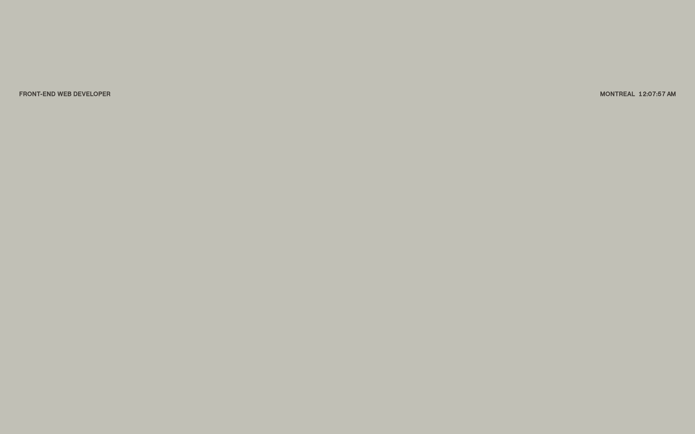

# constancesouville Design System

You are building UI for **constancesouville**. Light-themed, neutral palette, sans-serif typography (PP Neue Montreal), standard density on a 8px grid, flat elevation (no shadows).

## Visual Reference

**IMPORTANT**: Study ALL screenshots below before writing any UI. Match colors, typography, spacing, layout, and motion exactly as shown.

### Homepage



> Read `references/DESIGN.md` for full token details.

## Design Philosophy

- **Solid colors only** — no gradients anywhere. Every surface is a single flat color.
- **Type pairing** — PP Neue Montreal for body/UI text, PP Editorial New for headings/display. Never introduce a third typeface.
- **standard density** — 8px base grid. Every dimension is a multiple of 8.
- **neutral palette** — the color temperature runs neutral, matching the sans-serif typography.
- **Subtle motion** — transitions smooth state changes. Keep durations under 300ms, use ease-out curves.

## Color System

### Core Palette

| Role | Token | Hex | Use |
|------|-------|-----|-----|
| Background | `--background` | `#ffffff` | Page/app background |
| Surface | `--surface` | `#fbefdf` | Cards, panels, modals |
| Text Muted | `--text-muted` | `#c1c0b6` | Captions, placeholders |
| Border | `--border` | `#3f3b37` | Dividers, card borders |

### Status Colors

| Status | Hex | Use |
|--------|-----|-----|
| Warning | `#e7aa2c` | Caution states, pending items |
| Danger | `#db4c44` | Errors, destructive actions |

### Extended Palette

- `#b2b2a8`

## Typography

### Font Stack

- **PP Neue Montreal** — Heading 1, Heading 2, Heading 3
- **PP Editorial New** — Body, Caption

### Font Sources

```css
@font-face {
  font-family: "PP Editorial New";
  src: url("fonts/PPEditorialNew-Regular.woff2") format("woff2");
  font-weight: 400;
}
@font-face {
  font-family: "PP Neue Montreal";
  src: url("fonts/PPNeueMontreal-Regular.woff2") format("woff2");
  font-weight: 400;
}
```

### Type Scale

| Role | Family | Size | Weight |
|------|--------|------|--------|
| Heading 1 | PP Neue Montreal | 26rem | 700 |
| Heading 2 | PP Neue Montreal | 12.4rem | 700 |
| Heading 3 | PP Neue Montreal | 12rem | 700 |
| Body | PP Editorial New | 1.4rem | 400 |
| Caption | PP Editorial New | max(3rem,20px) | 400 |

### Typography Rules

- Body/UI: **PP Neue Montreal**, Headings: **PP Editorial New** — these are the only display fonts
- Max 3-4 font sizes per screen
- Headings: weight 600-700, body: weight 400
- Use color and opacity for text hierarchy, not additional font sizes
- Line height: 1.5 for body, 1.2 for headings

## Spacing & Layout

### Base Grid: 8px

Every dimension (margin, padding, gap, width, height) must be a multiple of **8px**.

### Spacing Scale

`8, 16, 32, 96, 112, 144, 160` px

### Spacing as Meaning

| Spacing | Use |
|---------|-----|
| 4-8px | Tight: related items within a group |
| 16px | Medium: between groups |
| 24-32px | Wide: between sections |
| 48px+ | Vast: major section breaks |

### Border Radius

Scale: `1.6rem, 2rem, 2.4rem, 2.8rem, 3.2rem, inherit`
Default: `2.8rem`

### Container

Max-width: `1019.98px`, centered with auto margins.

### Breakpoints

| Name | Value |
|------|-------|
| xs | 479.98px |
| xs | 480px |
| md | 767.98px |
| md | 768px |
| lg | 1019.98px |
| lg | 1020px |
| 2xl | 1440px |

Mobile-first: design for small screens, layer on responsive overrides.

## Component Patterns

### Card

```css
.card {
  background: #fbefdf;
  border: 1px solid #3f3b37;
  border-radius: 2.8rem;
  padding: 32px;
}
```

```html
<div class="card">
  <h3>Card Title</h3>
  <p>Card content goes here.</p>
</div>
```

### Button

```css
/* Primary */
.btn-primary {
  background: #cccccc;
  color: #cccccc;
  border-radius: 2.8rem;
  padding: 16px 32px;
  font-weight: 500;
  transition: opacity 150ms ease;
}
.btn-primary:hover { opacity: 0.9; }

/* Ghost */
.btn-ghost {
  background: transparent;
  border: 1px solid #3f3b37;
  color: #cccccc;
  border-radius: 2.8rem;
  padding: 16px 32px;
}
```

```html
<button class="btn-primary">Get Started</button>
<button class="btn-ghost">Learn More</button>
```

### Input

```css
.input {
  background: #ffffff;
  border: 1px solid #3f3b37;
  border-radius: 2.8rem;
  padding: 16px 16px;
  color: #cccccc;
  font-size: 14px;
}
.input:focus { border-color: var(--accent); outline: none; }
```

```html
<input class="input" type="text" placeholder="Search..." />
```

### Badge / Chip

```css
.badge {
  display: inline-flex;
  align-items: center;
  padding: 8px 16px;
  border-radius: 9999px;
  font-size: 12px;
  font-weight: 500;
  background: #fbefdf;
  color: #c1c0b6;
}
```

```html
<span class="badge">New</span>
<span class="badge">Beta</span>
```

### Modal / Dialog

```css
.modal-backdrop { background: rgba(0, 0, 0, 0.6); }
.modal {
  background: #fbefdf;
  border: 1px solid #3f3b37;
  border-radius: inherit;
  padding: 32px;
  max-width: 480px;
  width: 90vw;
}
```

```html
<div class="modal-backdrop">
  <div class="modal">
    <h2>Dialog Title</h2>
    <p>Dialog content.</p>
    <button class="btn-primary">Confirm</button>
    <button class="btn-ghost">Cancel</button>
  </div>
</div>
```

### Table

```css
.table { width: 100%; border-collapse: collapse; }
.table th {
  text-align: left;
  padding: 16px 16px;
  font-weight: 500;
  font-size: 12px;
  color: #c1c0b6;
  text-transform: uppercase;
  letter-spacing: 0.05em;
  border-bottom: 1px solid #3f3b37;
}
.table td {
  padding: 16px;
  border-bottom: 1px solid #3f3b37;
}
```

```html
<table class="table">
  <thead><tr><th>Name</th><th>Status</th><th>Date</th></tr></thead>
  <tbody>
    <tr><td>Item One</td><td>Active</td><td>Jan 1</td></tr>
    <tr><td>Item Two</td><td>Pending</td><td>Jan 2</td></tr>
  </tbody>
</table>
```

### Navigation

```css
.nav {
  display: flex;
  align-items: center;
  gap: 16px;
  padding: 16px 32px;
  border-bottom: 1px solid #3f3b37;
}
.nav-link {
  color: #c1c0b6;
  padding: 16px 16px;
  border-radius: 2.8rem;
  transition: color 150ms;
}
```

```html
<nav class="nav">
  <a href="/" class="nav-link active">Home</a>
  <a href="/about" class="nav-link">About</a>
  <a href="/pricing" class="nav-link">Pricing</a>
  <button class="btn-primary" style="margin-left: auto">Get Started</button>
</nav>
```

### Extracted Components

These components were found in the codebase:

**Card** (`html`)
- Variants: `-list`

## Page Structure

The following page sections were detected:

- **Navigation** — Top navigation bar (3 items)
- **Hero** — Hero section (detected from heading structure)
- **Footer** — Page footer with links and info (2 items)
- **Cards** — Grid of 16 card elements (16 items)

When building pages, follow this section order and structure.

## Animation & Motion

This project uses **subtle motion**. Transitions smooth state changes without calling attention.

### CSS Animations

- `marquee-right`
- `marquee-left`

### Motion Tokens

- **Duration scale:** `0ms`, `.6s`, `100ms`, `200ms`, `400ms`, `500ms`, `550ms`, `600ms`, `750ms`, `800ms`, `1200ms`
- **Easing functions:** `cubic-bezier(.215,.61,.355,1)`, `cubic-bezier(.645,.045,.355,1)`, `linear`, `ease-out`, `cubic-bezier(.25,.46,.45,.94)`

### Motion Guidelines

- **Duration:** Use values from the duration scale above. Short (0ms) for micro-interactions, long (1200ms) for page transitions
- **Easing:** Use `cubic-bezier(.215,.61,.355,1)` as the default easing curve
- **Direction:** Elements enter from bottom/right, exit to top/left
- **Reduced motion:** Always respect `prefers-reduced-motion` — disable animations when set

## Depth & Elevation

This design uses **flat elevation** — no box-shadows anywhere.

### Elevation Strategy

| Level | Technique | Use |
|-------|-----------|-----|
| 0 — Base | Background color | Page background |
| 1 — Raised | Lighter surface + subtle border | Cards, panels |
| 2 — Floating | Even lighter surface + stronger border | Dropdowns, popovers |
| 3 — Overlay | Backdrop + modal surface | Modals, dialogs |

### Z-Index Scale

`0, 1, 2, 10`

Use these exact values — never invent z-index values.

## Anti-Patterns (Never Do)

- **No box-shadow** on any element — use borders and surface colors for depth
- **No gradients** — solid colors only, everywhere
- **No blur effects** — no backdrop-blur, no filter: blur()
- **No zebra striping** — tables and lists use borders for separation
- **No invented colors** — every hex value must come from the palette above
- **No arbitrary spacing** — every dimension is a multiple of 8px
- **No extra fonts** — only PP Neue Montreal and PP Editorial New are allowed
- **No arbitrary border-radius** — use the scale: 1.6rem, 2rem, 2.4rem, 2.8rem, 3.2rem
- **No opacity for disabled states** — use muted colors instead
- **No pill shapes** — this design doesn't use rounded-full / 9999px radius

## Workflow

1. **Read** `references/DESIGN.md` before writing any UI code
2. **Pick colors** from the Color System section — never invent new ones
3. **Set typography** — PP Neue Montreal, PP Editorial New only, using the type scale
4. **Build layout** on the 8px grid — check every margin, padding, gap
5. **Match components** to patterns above before creating new ones
6. **Apply elevation** — flat, surface color shifts only
7. **Validate** — every value traces back to a design token. No magic numbers.

## Brand Spec

- **Favicon:** `favicon/apple-touch-icon.png`
- **Site URL:** `https://constancesouville.com`
- **Brand typeface:** PP Neue Montreal

## Quick Reference

```
Background:     #ffffff
Surface:        #fbefdf
Text:           (not extracted) / #c1c0b6
Accent:         (not extracted)
Border:         #3f3b37
Font:           PP Neue Montreal
Spacing:        8px grid
Radius:         2.8rem
Components:     4 detected
```

## When to Trigger

Activate this skill when:
- Creating new components, pages, or visual elements for constancesouville
- Writing CSS, Tailwind classes, styled-components, or inline styles
- Building page layouts, templates, or responsive designs
- Reviewing UI code for design consistency
- The user mentions "constancesouville" design, style, UI, or theme
- Generating mockups, wireframes, or visual prototypes

---

# Full Reference Files

> Every output file is embedded below. Claude has full design system context from /skills alone.

## Design System Tokens (DESIGN.md)

# constancesouville DESIGN.md

> Auto-generated design system — reverse-engineered via static analysis by skillui.
> Frameworks: None detected
> Colors: 7 · Fonts: 2 · Components: 4
> Icon library: not detected · State: not detected
> Primary theme: light · Dark mode toggle: no · Motion: subtle

## Visual Reference

**Match this design exactly** — study colors, fonts, spacing, and component shapes before writing any UI code.


---

## 1. Visual Theme & Atmosphere

This is a **light-themed** interface with a neutral, approachable feel. The light background emphasizes content clarity. Typography pairs **PP Editorial New** for display/headings with **PP Neue Montreal** for body text, creating clear visual hierarchy through type contrast. Spacing follows a **8px base grid** (standard density), with scale: 8, 16, 32, 96, 112, 144, 160px. Motion is subtle — smooth transitions (150-300ms) ease state changes without drawing attention.

---

## 2. Color Palette & Roles

| Token | Hex | Role | Use |
|---|---|---|---|
| background | `#ffffff` | background | Page background, darkest surface |
| surface | `#fbefdf` | surface | Card and panel backgrounds |
| theme-color | `#c1c0b6` | text-muted | Captions, placeholders, secondary info |
| border | `#3f3b37` | border | Dividers, card borders, outlines |
| tile-color | `#db4c44` | danger | Error states, destructive actions |
| warning | `#e7aa2c` | warning | Warning states, caution indicators |
| unknown | `#b2b2a8` | unknown | Palette color |


---

## 3. Typography Rules

**Font Stack:**
- **PP Neue Montreal** — Heading 1, Heading 2, Heading 3
- **PP Editorial New** — Body, Caption

**Font Sources:**

```css
@font-face {
  font-family: "PP Editorial New";
  src: url("fonts/PPEditorialNew-Regular.woff2") format("woff2");
  font-weight: 400;
}
@font-face {
  font-family: "PP Neue Montreal";
  src: url("fonts/PPNeueMontreal-Regular.woff2") format("woff2");
  font-weight: 400;
}
```

| Role | Font | Size | Weight |
|---|---|---|---|
| Heading 1 | PP Neue Montreal | 26rem | 700 |
| Heading 2 | PP Neue Montreal | 12.4rem | 700 |
| Heading 3 | PP Neue Montreal | 12rem | 700 |
| Body | PP Editorial New | 1.4rem | 400 |
| Caption | PP Editorial New | max(3rem,20px) | 400 |

**Typographic Rules:**
- Limit to 2 font families max per screen
- Use **PP Neue Montreal** for body/UI text, **PP Editorial New** for display/headings
- Maintain consistent hierarchy: no more than 3-4 font sizes per screen
- Headings use bold (600-700), body uses regular (400)
- Line height: 1.5 for body text, 1.2 for headings
- Use color and opacity for secondary hierarchy, not additional font sizes


---

## 4. Component Stylings

### Layout (1)

**Footer** — `html`

### Navigation (1)

**Navigation** — `html`

### Data Display (2)

**Card** — `html`
- Variants: `-list`

**List** — `html`


---

## 5. Layout Principles

- **Base spacing unit:** 8px
- **Spacing scale:** 8, 16, 32, 96, 112, 144, 160
- **Border radius:** 1.6rem, 2rem, 2.4rem, 2.8rem, 3.2rem, inherit
- **Max content width:** 1019.98px

**Spacing as Meaning:**
| Spacing | Use |
|---|---|
| 4-8px | Tight: related items within a group |
| 16px | Medium: between groups |
| 24-32px | Wide: between sections |
| 48px+ | Vast: major section breaks |


---

## 6. Depth & Elevation

No box-shadow values detected. The design appears to use a flat visual style.

**Z-Index Scale:** `0, 1, 2, 10`


---

## 7. Animation & Motion

This project uses **subtle motion**. Transitions smooth state changes without demanding attention.

### CSS Animations

- `@keyframes marquee-right`
- `@keyframes marquee-left`

### Motion Guidelines

- Duration: 150-300ms for micro-interactions, 300-500ms for page transitions
- Easing: `ease-out` for enters, `ease-in` for exits
- Always respect `prefers-reduced-motion`


---

## 8. Do's and Don'ts

### Do's

- Use `#ffffff` as the primary page background
- Pair **PP Neue Montreal** (body) with **PP Editorial New** (display) — these are the only allowed fonts
- Follow the **8px** spacing grid for all margins, padding, and gaps
- Use border and background shifts for elevation — not shadows
- Use border-radius from the scale: 1.6rem, 2rem, 2.4rem, 2.8rem, 3.2rem
- Reuse existing components from Section 4 before creating new ones

### Don'ts

- Don't introduce colors outside this palette — extend the design tokens first
- Don't introduce additional font families beyond PP Neue Montreal and PP Editorial New
- Don't use arbitrary spacing values — stick to multiples of 8px
- Don't add box-shadow — this design system uses flat elevation
- Don't use gradients — the design uses solid colors only
- Don't use arbitrary border-radius values — pick from the defined scale
- Don't duplicate component patterns — check Section 4 first
- Don't use backdrop-blur or blur effects

### Anti-Patterns (detected from codebase)

- No box-shadow on any element
- No gradient backgrounds
- No blur or backdrop-blur effects
- No zebra striping on tables/lists


---

## 9. Responsive Behavior

| Name | Value | Source |
|---|---|---|
| xs | 479.98px | css |
| xs | 480px | css |
| md | 767.98px | css |
| md | 768px | css |
| lg | 1019.98px | css |
| lg | 1020px | css |
| 2xl | 1440px | css |

**Approach:** Use `@media (min-width: ...)` queries matching the breakpoints above.


---

## 10. Agent Prompt Guide

Use these as starting points when building new UI:

### Build a Card

```
Background: #fbefdf
Border: 1px solid #3f3b37
Radius: 2.8rem
Padding: 32px
Font: PP Neue Montreal
No shadows — use borders and surface colors for depth.
```

### Build a Button

```
Primary: bg var(--accent), text white
Ghost: bg transparent, border #3f3b37
Padding: 16px 32px
Radius: 2.8rem
Hover: opacity 0.9 or lighter shade
Focus: ring with var(--accent)
```

### Build a Page Layout

```
Background: #ffffff
Max-width: 1019.98px, centered
Grid: 8px base
Responsive: mobile-first, breakpoints from Section 9
```

### Build a Stats Card

```
Surface: #fbefdf
Label: #c1c0b6 (muted, 12px, uppercase)
Value: var(--text-primary) (primary, 24-32px, bold)
Status: use success/warning/danger from Section 2
```

### Build a Form

```
Input bg: #ffffff
Input border: 1px solid #3f3b37
Focus: border-color var(--accent)
Label: #c1c0b6 12px
Spacing: 32px between fields
Radius: 2.8rem
```

### General Component

```
1. Read DESIGN.md Sections 2-6 for tokens
2. Colors: only from palette
3. Font: PP Neue Montreal, type scale from Section 3
4. Spacing: 8px grid
5. Components: match patterns from Section 4
6. Elevation: flat, surface shifts
```

## Bundled Fonts (fonts/)

The following font files are bundled in the `fonts/` directory:

- `fonts/PPEditorialNew-300.woff`
- `fonts/PPEditorialNew-300.woff2`
- `fonts/PPEditorialNew-Regular.woff`
- `fonts/PPEditorialNew-Regular.woff2`
- `fonts/PPNeueMontreal-500.woff`
- `fonts/PPNeueMontreal-500.woff2`
- `fonts/PPNeueMontreal-Regular.woff`
- `fonts/PPNeueMontreal-Regular.woff2`

Use these local font files in `@font-face` declarations instead of fetching from Google Fonts.

## Homepage Screenshots (screenshots/)


